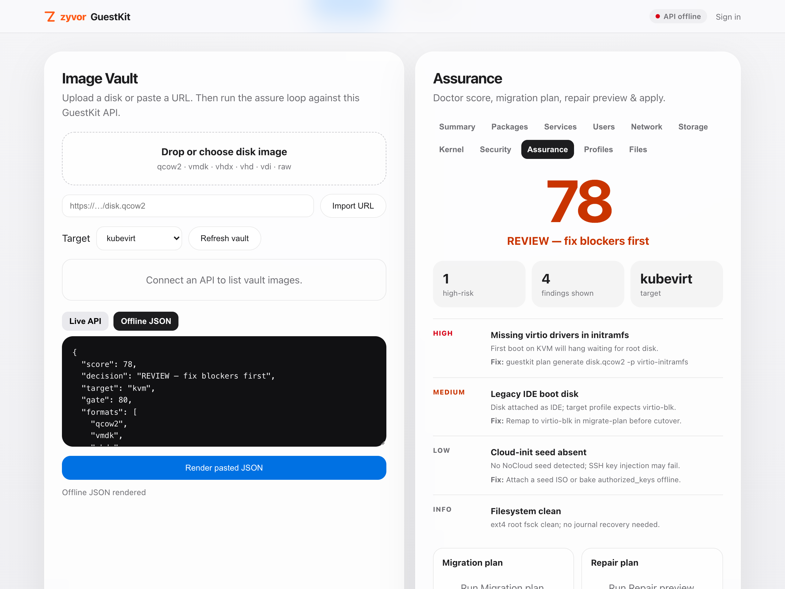
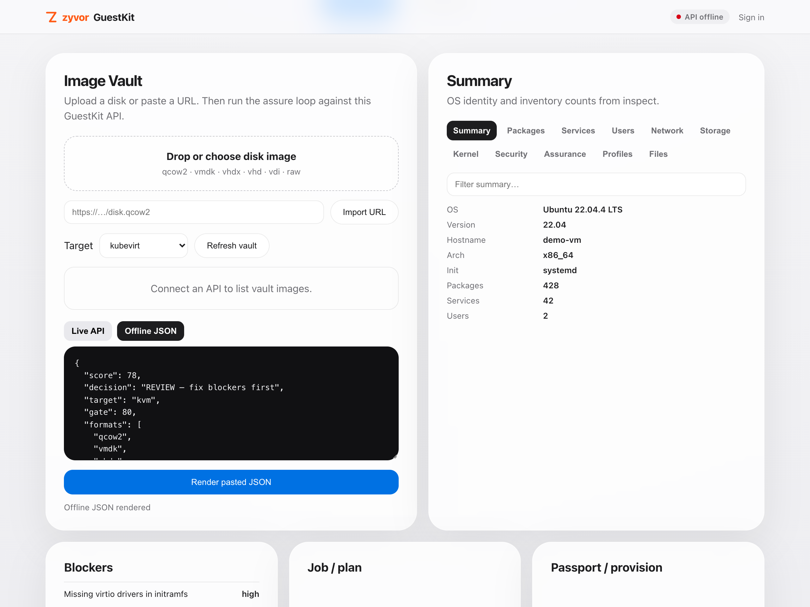
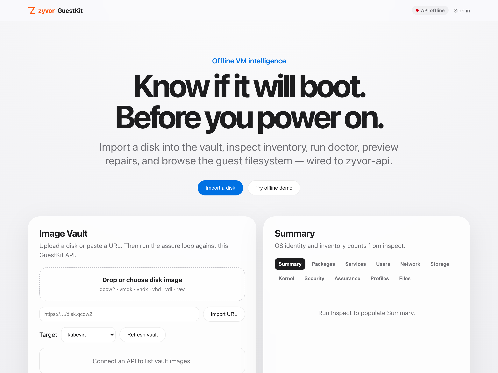

# Gallery

> Part of the [GuestKit README](../README.md). Back to the [documentation map](documentation-map.md).

# Gallery

The web console (`deploy/ui`, image `ghcr.io/zyvorai/zyvor-ui`) — **Offline demo** mode, which renders the JSON that ships with the UI. These are captures of that demo data, not of a live deployment; regenerate them with [`scripts/capture-ui-demo.py`](../scripts/capture-ui-demo.py).

Recorded live against real deployments — CLI, TUI, the web dashboard on a KubeVirt cluster, and the guest agent:

<table>
<tr>
<td width="50%" align="center">
<a href="https://www.youtube.com/watch?v=lLEBQoFceIs">

 <b>▶ CLI &amp; TUI</b>
</a>
 Offline VM intelligence, explained
</td>
<td width="50%" align="center">
<a href="https://www.youtube.com/watch?v=usQX2rQIFM8">

 <b>▶ Web Dashboard — Overview</b>
</a>
 Server Image Vault, live KubeVirt cluster
</td>
</tr>
<tr>
<td width="50%" align="center">
<a href="https://www.youtube.com/watch?v=icTLVko588A">

 <b>▶ Web Dashboard — Deep Dive</b>
</a>
 Sources, live cluster, one-click intelligence
</td>
<td width="50%" align="center">
<a href="https://www.youtube.com/watch?v=LYoqOye3P3I">

 <b>▶ Machina × GuestKit</b>
</a>
 Live Linux guest agent — health, TRIM, netplan, services
</td>
</tr>
</table>
